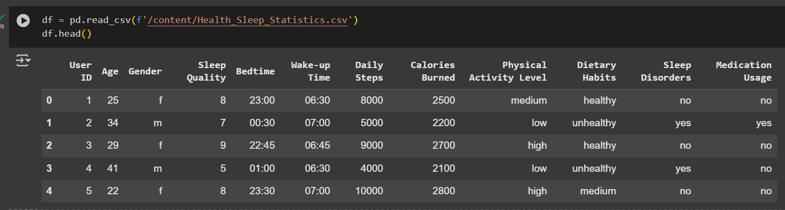
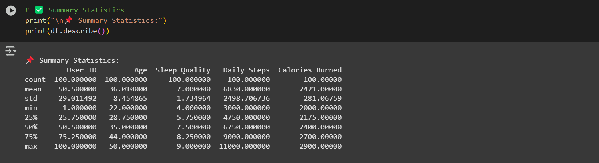
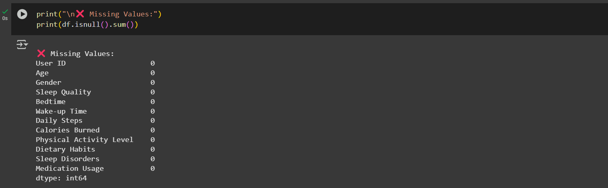
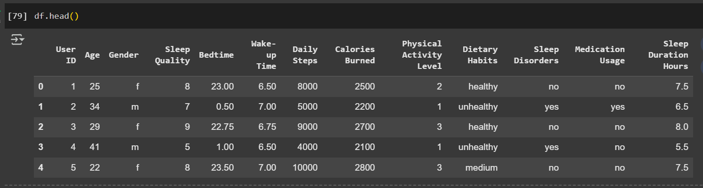
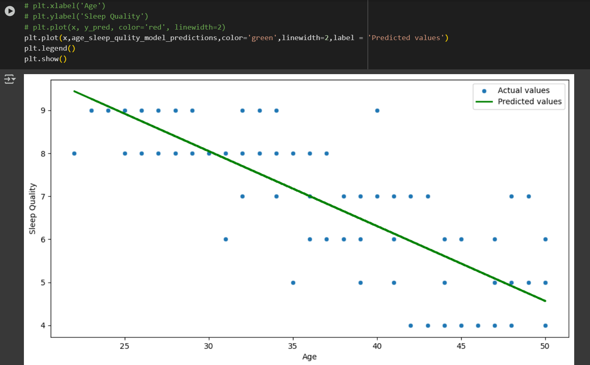
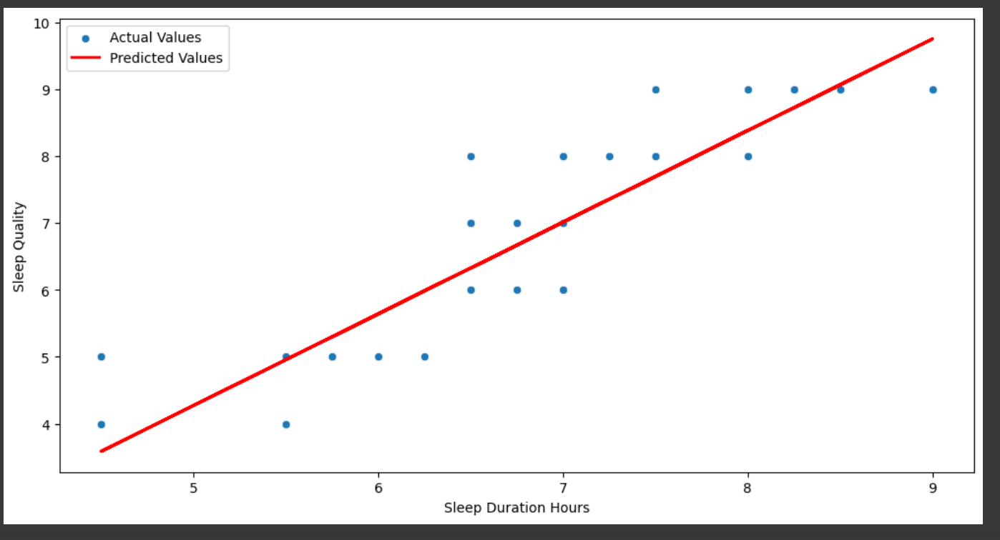

# 💤 Health & Sleep Statistics Analysis 🏋️‍♂️

This project explores **health and sleep statistics**, analyzing correlations between **sleep quality, physical activity, diet, and other factors**. It includes **data visualization, exploratory analysis (EDA), and insights** using Python and Jupyter Notebook.

---

## 📂 Project Structure
```
project_name
│── 📂 assets                # Contains images for visualization
│    ├── related assets         # Example: Correlation Heatmap
│── 📜 healthandsleepstat.ipynb  # Jupyter Notebook for analysis
│── 📜 README.md             # Project documentation (this file)
```

---

## 📊 Dataset Overview

The dataset contains health and sleep statistics with the following key attributes:
- **Sleep Quality** (Target Variable)
- **Daily Steps** (Physical Activity)
- **Calories Burned**
- **Physical Activity Level** (Low, Medium, High)
- **Dietary Habits** (Healthy, Unhealthy, Medium)
- **Sleep Disorders** (Yes/No)
- **Medication Usage** (Yes/No)

---

## 🔍 Exploratory Data Analysis (EDA)
### 1️⃣ Initial Dataset


### 2️⃣ Dataset Info
A snapshot of dataset metadata, including column names, data types, and non-null counts.


### 3️⃣ Dataset Description
Summarized statistics (e.g., mean, median, standard deviation) for numerical features.


### 4️⃣ Missing Data Status
A visual representation of missing data across features.


### 5️⃣ Modified Dataset
The cleaned and preprocessed dataset after handling missing data and anomalies.



### 3️6️⃣ Correlation Heatmap
A heatmap showing correlations between numerical features.


###  Age vs Sleep Quality
A bar plot depicting the relationship between Age and Sleep Quality.

### 7️⃣ Age vs Sleep Quality Prediction By Model
This scatterplot shows the relationship between Actual Age vs  predicted Sleep Quality



### 8️⃣ Overall Prediction By Model
A scatter plot showcasing the accuracy of model predictions for all features.



---

## 🛠️ How to Run
 **Run Jupyter Notebook**
   ```bash
   jupyter notebook healthandsleepstat.ipynb
   ```

---

## 📜 Key Findings
- Individuals with **higher physical activity levels** generally experience **better sleep quality**.
- **Dietary habits** play a significant role in **calories burned and sleep quality**.
- **People with sleep disorders** tend to have **lower sleep quality**.

---

## 📌 Future Improvements
- **Feature Engineering** (e.g., sleep duration calculation)
- **Predictive Modeling** (Regression/Classification)
- **More Datasets** for generalization

---
---

## 👨‍💻 Author
**Md Nasir Uddin**  
📧 Email: nasirpks36@gmail.com  

